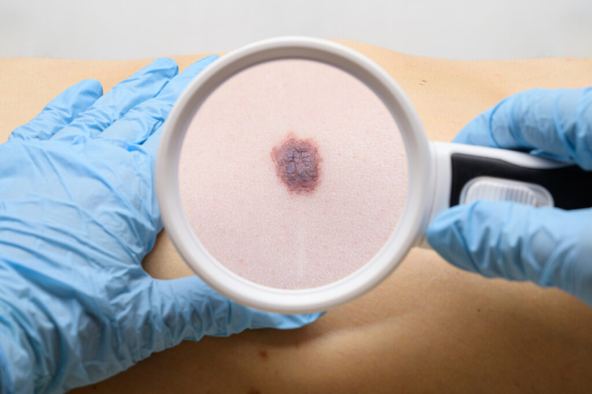

# Skin-Cancer-Detection
A ML project for detecting skin cancer using TensorFlow-keras
# Skin Cancer Detection with Deep Learning

Skin cancer is one of the most common types of cancer worldwide, with over 105,000 new cases of melanoma diagnosed in the United States in 2025, leading to approximately 8,000 deaths, while globally more than 1.5 million new cases have been reported. The primary causes include exposure to UV radiation from the sun, and symptoms involve changes in moles or skin lesions such as asymmetry, irregular borders, and color variations; however, late detection can significantly reduce survival rates. This project uses artificial intelligence and deep learning (such as pre-trained EfficientNet models in TensorFlow) to automatically detect skin cancer from images, helping to solve this problem. Its importance lies in providing a fast and accurate tool for early detection that can save lives, assist doctors, and increase access to healthcare in underserved areas, especially in 2025 trends focusing on AI innovations in medicine.

## Progress
- Data Understanding: Updated data_exploration.ipynb to inspect dataset images and quality.

## Progress
- Data Understanding: Inspected dataset images and quality in data_exploration.ipynb.
- Data Preparation: Added DataPreparation.ipynb for preprocessing and augmentation.
